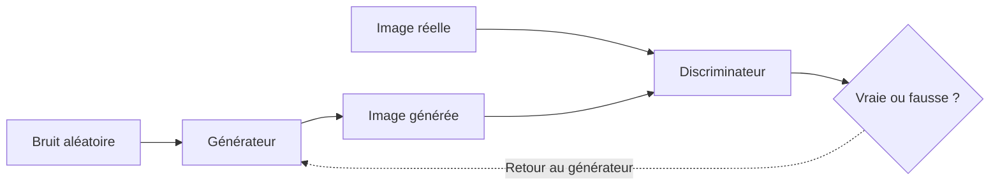
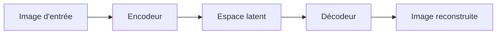
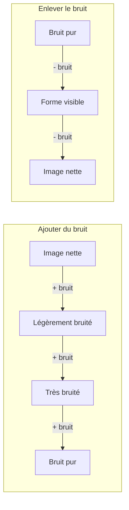

# Generative AI en Computer Vision

---

## Ce que c'est vraiment

La plupart des gens pensent que l'IA "cherche" une image dans une base de données quand on lui demande d'en créer une. Ce n'est pas ce qui se passe.

Un modèle génératif ne stocke pas d'images. Il apprend des **patterns** — les formes qui reviennent, les textures, les relations entre les objets — et à partir de ça, il devient capable d'assembler quelque chose de nouveau. Comme un musicien qui a écouté des milliers de morceaux et qui peut improviser sans jamais recopier.

C'est ça la Generative AI en Computer Vision : un système qui a appris à voir, et qui utilise cette compréhension pour créer.

---

## Pourquoi ça change quelque chose

Avant, produire une image demandait soit un humain (dessinateur, photographe), soit une banque d'images existante. Les deux ont des limites évidentes : le temps, le coût, et le fait que tu ne peux montrer que ce qui existe déjà.

La GenAI casse ces trois limites en même temps.

Quelques cas où ça devient concret :

- **En médecine**, certaines maladies sont si rares qu'on n'a pas assez d'images pour entraîner des modèles de diagnostic. On peut maintenant en générer artificiellement — des images synthétiques mais réalistes, qui permettent d'entraîner des outils qui sauvent des vies.
- **En sécurité informatique**, on génère de fausses attaques visuelles pour tester des systèmes de défense avant qu'une vraie menace n'arrive.
- **En design et e-commerce**, une description textuelle suffit à produire des centaines de variantes visuelles en quelques minutes.

Ce n'est pas juste un gain de temps. C'est une capacité qui n'existait tout simplement pas avant.

---

## Les trois façons de faire

Il n'y a pas qu'une seule manière de construire un modèle génératif. Trois architectures dominent, et elles partent chacune d'une intuition très différente.

---

### GAN — deux réseaux qui se battent

L'idée de base est simple : faire travailler deux réseaux l'un contre l'autre.

Le premier, le **générateur**, part de bruit aléatoire et essaie de produire une image crédible. Le second, le **discriminateur**, reçoit un mélange d'images réelles et d'images générées, et doit les distinguer. Le générateur essaie de tromper le discriminateur. Le discriminateur essaie de ne pas se faire avoir. Ils s'améliorent ensemble.

Ce qui rend le GAN puissant, c'est aussi ce qui le rend difficile : l'équilibre entre les deux réseaux est fragile. Si le discriminateur devient trop fort trop vite, le générateur ne reçoit plus de signal utile pour s'améliorer.

**Avantages :** images très réalistes, génération rapide

**Limites :** entraînement instable, risque de mode collapse, contrôle limité

**Exemple :** StyleGAN de NVIDIA — chaque visage sur thispersondoesnotexist.com est généré par un GAN.

---

### VAE — comprendre pour reconstruire

Le VAE part d'une idée différente : plutôt que d'opposer deux réseaux, on va apprendre à **comprendre la structure** des images.

L'encodeur prend une image et la comprime en un petit vecteur de nombres — ses coordonnées dans un espace appelé espace latent. Le décodeur prend ces coordonnées et reconstruit l'image.

La subtilité du VAE : l'espace latent est organisé de façon continue. Des images similaires se retrouvent proches dans cet espace. Ça permet d'interpoler progressivement entre deux images, ou de modifier une seule caractéristique sans toucher au reste.

**Avantages :** entraînement stable, espace latent navigable, mathématiquement solide

**Limites :** images parfois floues, contrôle textuel faible

**Exemple :** génération d'images médicales synthétiques pour augmenter des datasets de maladies rares.

---

### Diffusion — partir du chaos

Les modèles de diffusion sont les plus récents des trois, et ils dominent aujourd'hui le marché.

Pendant l'entraînement, on prend des images réelles et on les corrompt progressivement en ajoutant du bruit — jusqu'à ce qu'il ne reste plus rien d'identifiable. Le modèle apprend à inverser ce processus : étant donné une image bruitée, enlever ce bruit, étape par étape.

Une fois entraîné, on part d'un bruit aléatoire et on applique le processus inverse, étape par étape, jusqu'à faire émerger une image cohérente. Si on conditionne ce processus sur un texte, on obtient les modèles text-to-image qu'on connaît.

**Avantages :** meilleure qualité d'image des trois, excellent contrôle par texte, entraînement stable

**Limites :** lent à générer (des dizaines à des centaines d'étapes par image), coûteux en calcul

**Exemple :** DALL-E 3, Midjourney, Stable Diffusion.

---

## Comparaison

| | GAN | VAE | Diffusion |
|---|---|---|---|
| **Idée centrale** | Compétition générateur / discriminateur | Compression et reconstruction | Apprendre à enlever le bruit |
| **Qualité d'image** | Très bonne | Correcte, parfois floue | Excellente |
| **Stabilité d'entraînement** | Difficile | Stable | Stable |
| **Vitesse de génération** | Rapide | Rapide | Lent |
| **Contrôle par texte** | Faible | Faible | Excellent |
| **Statut en 2026** | En recul | Recherche | Dominant |

Il n'y a pas de meilleure architecture dans l'absolu. Un GAN reste pertinent quand la vitesse compte plus que le contrôle. Un VAE est utile quand on a besoin d'explorer un espace latent structuré. Les modèles de diffusion dominent dès qu'on a besoin de qualité et de guidage textuel.

---

## Pour finir

Ce qui est frappant avec ces trois architectures, c'est qu'elles ont toutes été développées dans la même décennie, et qu'elles convergent vers le même résultat — des machines capables de produire des images indiscernables du réel — en partant d'intuitions complètement différentes.

La question technique est en grande partie résolue. Ce qui reste ouvert, c'est la question de l'usage : ces outils amplifient ce qu'on décide d'en faire.
