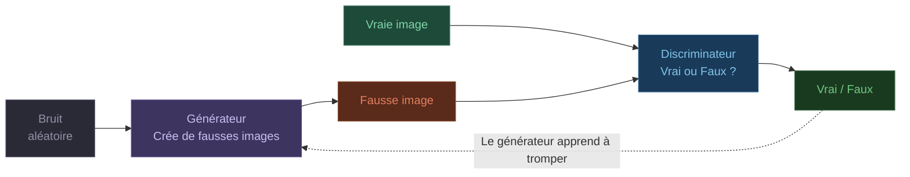
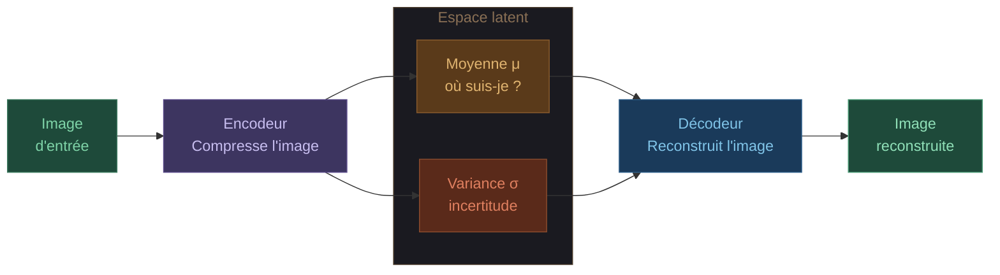
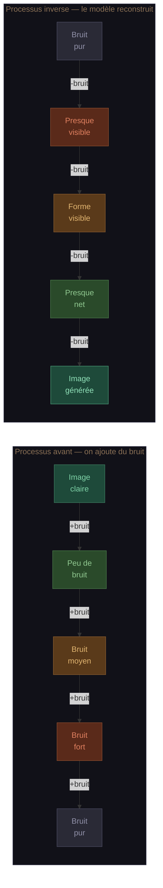

# La Generative AI en Computer Vision
### Expliqué comme si j'avais 5 ans

> Mini-TAF — Modeling – Generative AI — Avril 2026

---

## 1. C'est quoi la Generative AI en Computer Vision ?

Imagine que tu apprends à dessiner en regardant des milliers de photos de chats. Au bout d'un moment, tu es capable de dessiner un chat que tu n'as **jamais vu** — tu as compris les formes, les proportions, les couleurs. Tu ne copies pas. Tu inventes.

C'est exactement ce que fait la Generative AI en Computer Vision.

Un modèle étudie des millions d'images, comprend leur structure interne, et devient capable d'en **créer de nouvelles** — cohérentes, réalistes, et parfois indiscernables du réel.

**Exemples concrets :**
- Tu décris "un chat orange sur la lune" → le modèle génère cette image
- Le modèle crée des visages humains ultra-réalistes de personnes qui n'existent pas
- Tu envoies un croquis au crayon → il le transforme en photo réaliste

---

## 2. Pourquoi utiliser la GenAI ?

**Sans GenAI :**
Pour créer 1000 images de produits pour un site e-commerce → photographe, studio, jours de travail.

**Avec GenAI :**
Tu décris les produits → l'IA génère toutes les images en quelques minutes.

| Usage | Exemple concret |
|-------|----------------|
| Créer du contenu visuel rapidement | Générer des illustrations, designs, avatars en secondes |
| Réduire les coûts | Plus besoin de studio photo pour du contenu e-commerce |
| Augmenter les données (Data Augmentation) | En médecine, créer artificiellement des images de maladies rares pour entraîner d'autres modèles |
| Personnalisation | Générer des décors de jeux vidéo uniques pour chaque joueur |
| Améliorer la sécurité | Simuler de fausses cyberattaques visuelles pour entraîner des systèmes de défense |

---

## 3. Les architectures principales

Il existe 3 grandes familles de modèles génératifs en Computer Vision.

---

### 3.1 GAN — Generative Adversarial Network

**L'analogie : le faussaire et le détective**

> Un faussaire essaie de reproduire des billets de banque. Un détective tente de les détecter. Le faussaire améliore sa technique, le détective affine son oeil. Après des milliers de rounds, les faux billets sont devenus indiscernables des vrais.

Un GAN repose sur **deux réseaux de neurones qui s'affrontent** :

**Avantages :**
- Génère des images très réalistes
- Rapide en inférence

**Limites :**
- Entraînement instable et difficile (risque de *mode collapse* — le générateur ne produit plus qu'un seul type d'image)
- Contrôle limité sur ce qui est généré

**Exemple réel :** StyleGAN de NVIDIA — chaque visage sur [thispersondoesnotexist.com](https://thispersondoesnotexist.com) est généré par un GAN.

---

### 3.2 VAE — Variational Autoencoder

**L'analogie : la carte du pays des images**

> Tu as visité 1000 villes. Au lieu de mémoriser chaque détail, tu dessines une carte mentale : les villes côtières à gauche, les montagnes à droite, les villes froides en haut. Pour inventer une nouvelle ville, tu pointes un endroit sur la carte — même si tu n'y es jamais allé.

Un VAE encode chaque image comme des **coordonnées dans un espace mathématique** appelé espace latent, puis les reconstruit à partir de ces coordonnées.

**Avantages :**
- Entraînement stable
- Espace latent continu — on peut naviguer entre les images (ex : passer progressivement d'un visage souriant à un visage neutre)
- Solide mathématiquement

**Limites :**
- Images parfois floues ou moins nettes que les GAN
- Contrôle textuel limité

**Exemple réel :** Génération d'images médicales pour augmenter des datasets de maladies rares.

---

### 3.3 Diffusion Models

**L'analogie : le puzzle qui se défait et se refait**

> Tu prends une photo et tu l'abimes progressivement — un peu de grain, puis plus, jusqu'à obtenir un tas de pixels aléatoires. Le modèle observe ce processus des milliers de fois. Puis on lui demande de faire l'inverse : partir du chaos et reconstruire une image cohérente, étape par étape.

**Avantages :**
- Meilleure qualité d'image parmi les trois architectures
- Excellent contrôle via texte (text-to-image)
- Entraînement stable

**Limites :**
- Lent à générer (50 à 1000 étapes de débruitage nécessaires)
- Coûteux en ressources de calcul

**Exemple réel :** DALL-E 3, Midjourney, Stable Diffusion — tu écris *"un astronaute qui joue de la guitare sur Mars"* → image générée en quelques secondes.

---

## 4. Comparaison simple

| Critère | GAN | VAE | Diffusion |
|---------|-----|-----|-----------|
| **Idée centrale** | Compétition faussaire / détective | Carte de l'espace des images | Apprendre à enlever le bruit |
| **Qualité des images** | Très réaliste | Parfois flou | Excellent |
| **Stabilité entraînement** | Difficile | Stable | Stable |
| **Vitesse de génération** | Rapide | Rapide | Lent |
| **Contrôle texte-image** | Limité | Limité | Excellent |
| **Navigation dans l'espace latent** | Partielle | Fluide | Partielle |
| **Popularité 2025-2026** | En déclin | Recherche | Dominant |
| **Exemples connus** | StyleGAN, DeepFake | beta-VAE, médical | DALL-E 3, Midjourney, Stable Diffusion |

**En résumé :**
- **GAN** — Rapide et réaliste, mais entraînement capricieux et difficile à guider
- **VAE** — Stable, espace latent continu et navigable, mais images moins nettes
- **Diffusion** — Meilleure qualité et excellent contrôle textuel, mais lent — domine le marché depuis 2022

---

## Conclusion

En quelques années, la Generative AI en Computer Vision a changé ce qu'on entend par "créer une image". On est passés de simples filtres à des systèmes capables de matérialiser visuellement n'importe quelle description textuelle.

Les trois architectures — GAN, VAE, et Diffusion — représentent chacune une réponse différente à la même question fondamentale : **comment apprendre à imaginer ?**

Aujourd'hui, les modèles de diffusion dominent. Mais la recherche continue et de nouvelles architectures hybrides émergent régulièrement.

> "L'imagination est plus importante que la connaissance." — Albert Einstein
>
> En 2025, les machines ont appris à imaginer. La question qui se pose maintenant n'est plus technique — elle est éthique et créative.

---

*Mini-TAF — Modeling – Generative AI — Deadline : 10 avril 2026*
